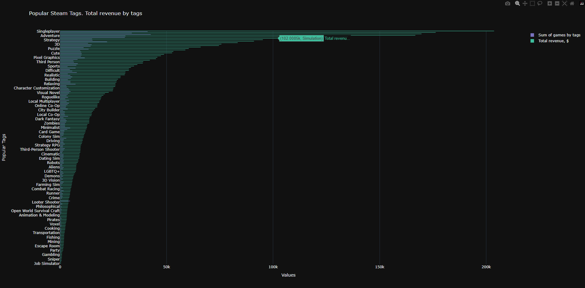
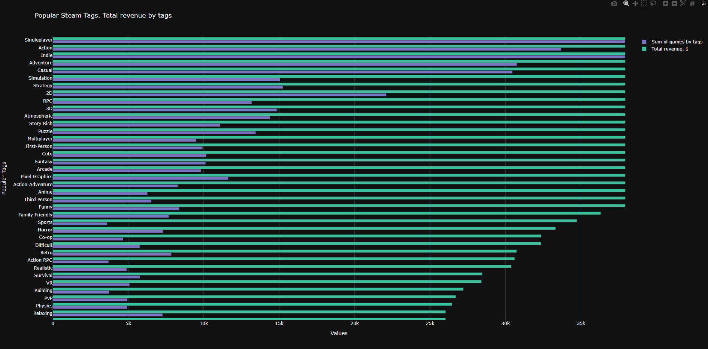
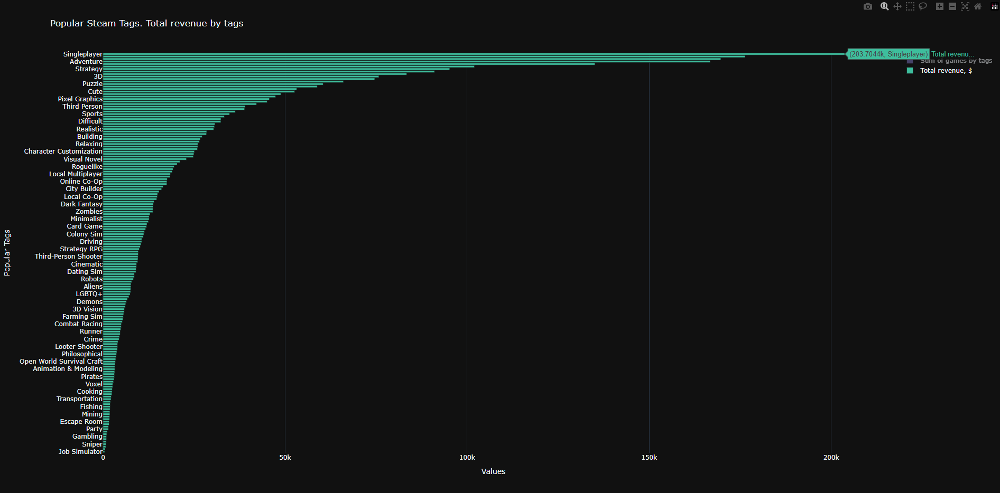

# Steam-game-analytics

    <h2> Цель проекта: </h2>
    
 Анализировать какие тэги в Steam проносят больше всего дохода и средней выручки 

    <h2> Что я сделал? </h2>
    
 Анализировал датасет взятый из сайта Kaggle (url датасета находится в config) про Steam Games Dataset 2024.   Создал новый датафрейм: количество игр в тэге, общий доход (total revenue), средняя выручка (avg) 

 
  <h3> Инструменты, которые я использовал: </h3>
  
<strong>Pandas</strong> — для работы с датасетом, и создания нового датафрейма

  
<strong>Plotly</strong> — для построения интерактивного графика

 
    <h3> Трудности, с которыми я столкнулся: </h3>
    
 Самое сложное в этом проекте было создать словарь подсчёта количество тэгов и их дохода 

 
<h2> Фотографии графиков </h2>
    
 Можно сделать вывод, что тэг Singleplayer имеет самый наибольший доход 

    

          
          
        
    

